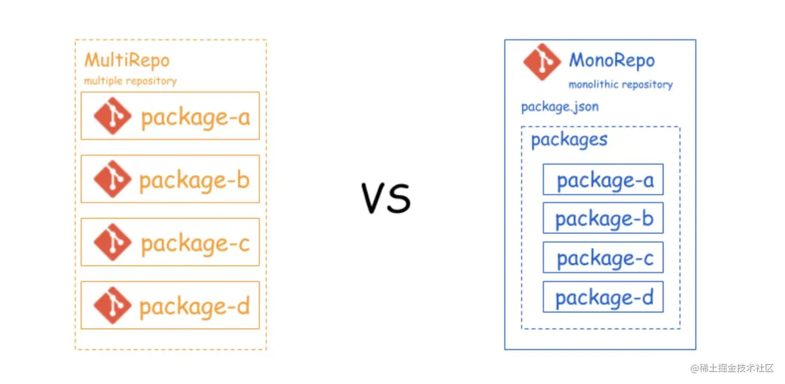

# 平台化：平台子应用聚合方案

[[toc]]

## 当前存在问题

当前业务应用工程超过 135 个，其中国内业务共四个矩阵 App 超过 120 个，海外业务超过 15 个。一方面由于子应用各自相对独立，升级和新增容易摆脱旧有的历史包袱，但另一方面长远来看不利于统一的升级、维护与迁移。因而调研相关技术，寻求有效收拢各个子应用统一管理的方案。

## 解决方案

期望通过 monorepo 的策略解决子应用工程过多、难以管理的问题。目标让 130+的子应用工程缩减为 6 个（5 个业务 App 各占一个，通用功能独立一个）。

### 什么是 monorepo

先简单介绍 monorepo 的概念。monorepo 是一种将多个应用代码存储在一个仓库里的软件开发策略。相对的是 multirepo 策略，即各个应用单独维护维护一个仓库，也是当前荔枝前端大部分使用的策略。当前世界一流的互联网企业 Google，Facebook，还是社区知名的开源项目团队 Babel 都已经使用了 monorepo 策略管理他们的代码。采用该模式有以下优点与缺点：

### 优点

1. **易于重用**：因为项目统一维护，对于通用的代码逻辑更加抽离汇总，避免了各应用间的重复编写和维护。
2. **技术收拢**：前端技术繁杂多样，但背后的理念相通相似。当前互娱前端团队进行技术收拢，专注于 react、webpack 等技术栈，精通框架，掌握框架背后的理念，以小见大。集中管理更易于技术选型的准入准出。
3. **易于依赖管理**：当应用之间有相互依赖的关系时（比如工具库），借助 lerna 或 rush 等工具，能够自动升级依赖和构建。
4. **易于重构升级**：聚合管理一方面易于统一升级与重构，另一方面能更好评估影响范围，易于测试。
5. **迁移方便**：基于荔枝互娱团队过往经历和未来发展，可能会存在基于现有 App 衍生迁移出新 App 的需求。过往的操作是对子应用进行逐一迁移逐一改造，逐个分配权限和新增构建配置。在聚合管理后该场景会缩减为对单项目的一次操作，极大减少工作成本。

### 缺点

1. **权限管理**：由于各个应用统一到单个工程管理，细化到应用级别的代码和部署权限管理未有较好的实现方案。但从开放透明的组织文化来看，同项目组内业务代码一定程度的透明，配合合并分支权限的收拢，会更利于成员相互学习、共同成长。
2. **学习成本**：相比传统的 multirepo 项目，由于项目结构的变动和新工具的引入，在编码和使用方式上有一定不同，对开发人员有一定的学习要求，相应的技术文档也需完善与更新。

综合以上的优缺点分析，以及业内较多的成功经验，我认为在一定的学习成本下，monorepo 是合适的业务解决方案。

## 技术选型

当前实现 monorepo 的主流框架主要是 lerna 与 rush。本次技术选型从社区成熟和功能差异两个角度进行抉择。

### 社区成熟度

上图是截止当前（22/08/18）两个框架的统计数据。可以看到受欢迎程度和下载量都是 lerna 遥遥领先于 rush。高关注量和使用量伴随的是更成熟的社区和更广泛的讨论，当实际开发过程中遇到问题时更有可能寻找到相应的解决方案。

### 功能差异

从调研和实际试用上看，lerna 与 rush 两者都可以完全匹配当前 monorepo 的使用需求，主要的差异体现在：

#### rush:

- 规范性强，有非常细致的配置细分
- 包管理器支持 npm/yarn/pnpm，而由于支持 pnpm，解决了 Phantom dependencies(幽灵依赖)与 Doppelgangers（依赖分身）的问题
- 对 change log 的更新支持更好，lerna 则需要扩展

#### lerna:

- 配置简单，可扩展性好
- 版本号管理有成熟的 fixed/independent 两种模式，rush 的 version Policy 目前还是实验性功能
  从实际的使用体验上来说，两者生成的项目的结构相似，使用方式也相似，但 rush 的配置虽然有非常详尽的自带描述，但还是显得过于细致复杂，保留一定灵活性的同时是带来更高的学习成本。而 rush 主要解决的包管理问题由于当前团队已经借助 webpack 的 Module Federation 特性统一把三方模块抽离共用，在实际使用中带来的好处可以暂时忽略不计。

综合以上两点，我们最终决定采用 lerna 框架作为互娱 monorepo 的落地方案。

## 工程整体架构

在调整后计划的单业务线的业务工程架构如下。

由架构图的从下往上，从左往右的各分层介绍如下：

### 业务工程

- 基础工具：包含子应用和通用库的运行、构建脚本，统一的应用构建工具和构建过程中用到的区分灯塔、预发和线上环境的环境变量。
- 通用库：包含工具方法与业务配置(mf-config)。
  - 工具方法：原来分散在各个子应用中，更新相对频繁，重复度较高，体积又较小。从避免自我重复的角度上采用统一管理，从开发便捷上考虑选择内聚于业务工程而非通用依赖（mf-lib 中）。
  - 业务配置：即原来的 mf-config 工程，为避免更新时各应用需各自重新发布，依旧采用 Module Federation 的形式单独发布，各子应用从同一地址异步访问读取。
- 业务代码：各业务功能子应用的集合。

### 构建产物

各子应用单独构建单独部署。

### 通用依赖

以 Module Federation 的形式单独发布，各子应用从同一地址异步访问读取，最大程度利用浏览器缓存与减少业务子应用的构建体积和构建时间。

## 工程目录结构

### 部分目录与文件介绍

- `build`：构建工具与脚本。
- `dist`：子应用构建产物。各个子应用有单独的子目录，子目录默认取包名的项目名称部分(见下文描述)，可通过子应用的 package.json 的 distName 字段进行指定配置。
- `env`：环境变量。
- `packages`：包含业务子应用和通用库的各个子包。
  - `packages/apps`：业务子应用，应用包名采用业务名/项目名的形式，eg：@xm/family
  - `packages/libs`：通用库
- `public`：通用资源，如 html 模板等。
- `lerna.json`：lerna 框架配置项。
- `tsconfig.json`：各 typescripe 子应用及通用库共用配置，在各 typescripe 子包下继承扩展。

::: tip

1. [Monorepo 初探]()
2. [All in one：项目级 monorepo 策略最佳实践](https://fed.taobao.org/blog/taofed/do71ct/uihagy/)
3. [深入浅出 npm & yarn & pnpm 包管理机](https://mp.weixin.qq.com/s/X6eehnbs055Gmiw56Zs_DA)
4. [Monorepo + lerna & rush.js](https://www.its404.com/article/xiaobing_hope/114822269)

:::
