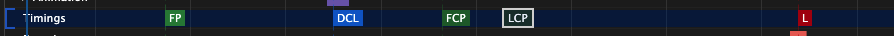

# h5 性能优化

[[toc]]

## 综述

原则之一是在性能出现问题时才优化，具体分析方法从两个维度去考虑。

一是网络维度，二是运行时维度。

实话说网络维度我们现阶段所能做的有限，运维部门所配置的访问配置基本都是最佳实践。但是随着公司业务的发展，全球化带来了新的问题，即网络延迟问题，离线包是解决手段之一。

## 1. 加载优化、渲染优化

现在通过前端工程化，我们的项目中已经集成了很多网络加载的最佳实践。

譬如脚手架打包工具会对资源压缩合并，优化文件摆放位置等。

当然最重要的还是要先找到性能优化点，然后再进行针对性优化。

::: tip 非运行时优化（网络侧优化）

1. 使用 CDN 来分发静态资源， 使用 HTTP2 的多路复用来突破浏览器并发限制。
2. 网络层面我们可以使用各级缓存，GZip 压缩、dns 预解析等加快资源到达速度。
3. 第一次运行时优化（首屏），我们可以预加载或者骨架屏来优化体验。
4. 客户端预先实例化 Webview 可用来减少 Webview 初始化的时间，从而减少白屏时间。

:::

::: tip 运行时的优化

1. 对于前端框架运行时的优化，在 Vue 中我们可以通过使用 Store 模式来规避，因为组件嵌套过深传递数据的链路过长问题，减少对子组件不必要的 render 和 diff。React 使用 useMemo 来手动优化数据变动重渲染。
2. 进一步，在高频操作响应式数据的地方，我们可以绕过框架中的渲染变动流程，直接对 dom 进行操作，减少在框架中进行计算开销。
3. 对 dom 的操作，尽量进行批量操作可大大减少浏览器解析和绘制时间。同事注意减少对盒子几何属性的改动，避免频繁回流（重新布局）。
4. 更进一步，我们可以使用视觉上欺骗，在长列表优化或图片加载优化中，我们可以懒加载， 或只渲染用户看到的 dom 结构。

:::

## 2. 首屏（first paint）、白屏优化概念及量化

[前端性能监控方案（首屏、白屏时间等）](https://juejin.cn/post/6844904020482457613)

可通过 Chrome devtools 中的 Performance 来查看

> 白屏时间 = 地址栏输入网址后回车 - 浏览器出现第一个元素首屏时间 = 地址栏输入网址后回车 - 浏览器第一屏渲染完成

**影响白屏时间的因素**：网络，服务端性能，前端页面结构设计。

**网络层面**，我们可以使用缓存、预加载、http2、资源压缩打包

**影响首屏时间的因素**：白屏时间，资源下载执行时间。

首屏时间随着 SPA 的盛行，传统的计算方法不太能反应真实的用户体验。

因此，我们看到很多大厂的统计方法，多为计算第一屏所有元素包括图片等静态资源完成加载后的时间

LCP 作为用户体验的核心指标。

| Tables |           Are            |                          Cool |                                                                                     |
| ------ | :----------------------: | ----------------------------: | ----------------------------------------------------------------------------------: |
| FP     |       First Paint        |                      首次绘制 | 它代表浏览器第一次向屏幕传输像素的时间， 也就是页面在屏幕上首次发生视觉变化的时间。 |
| DCL    |  DOMContentLoaded Event  | HTML 文档被完全加载和解析完成 |                                                                                     |
| FCP    |  First Contentful Paint  |                  首次内容绘制 |         只有首次绘制文本、图片（包含背景图）非白色的 canvas 或 SVG 时才被算作 FCP。 |
| LCP    | Largest Contentful Paint |              最大可见元素绘制 |                                                                                     |
| L      |       Onload Event       |                  内容加载完成 |                                                                                     |

js 开源库提供一站式性能指标统计，[web-vitals](https://github.com/GoogleChrome/web-vitals)

包括 ：

- 首次内容元素绘制（First Contentful Paint，FCP）
- 最大内容元素绘制（Largest Contentful Paint , LCP）
- 第一次输入延迟(First Input Delay, FID)
- 度量第一个字节的时间（Time to First Byte, TTFB）
- 累计布局偏移(Cumulative Layout Shift, CLS)

一般来说其中对首屏启动速度影响最大的就是网络请求

**优化方式**：

1. 网络侧

- 降低请求量：合并资源，减少 http 请求数，minify/zip 压缩，懒加载，webP

- 加快请求速度：预解析 DNS，减少域名数，并行加载，CDN 分发
- 缓存：HTTP 协议缓存请求，离线缓存 manifest，离线数据缓存 localStorage

2. 服务端渲染
3. 预渲染
4. 骨架屏

## 3. 打包优化

可以使用 webpack-bundle-analyzer 来查看我们的打包内容及大小，从而进行针对性优化

我们可以提取公共的包放到 CDN 上，减少包体积，优化打包速度

利用 Tree-Shaking 去掉没有引入使用的方法或者库

::: tip 参考

1. [性能之 Web 性能关键点（Web Vitals）](https://juejin.cn/post/6854573212177694733#heading-13)
2. [DOM, CSS, JS 的阻塞,解析渲染顺序](https://juejin.cn/post/6844903896343642125)
3. [浅谈 script 标签的 defer 和 async](https://juejin.cn/post/6844903560879013896)

:::
