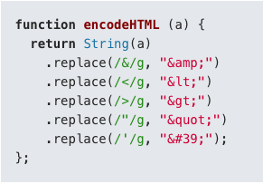

# web 前端安全

[[toc]]

## XSS 跨站脚本攻击

XSS 全称(Cross Site Scripting) 跨站脚本攻击， 是 Web 程序中最常见的漏洞。表现为己方网站执行了第三方的脚本。XSS 可分为三种类型：

### 1. 持久型 (type-2)

常见场景：攻击者在一个博客网站中的一篇博客下评论 ，恶意代码就会在所有访问这篇博客评论的用户的浏览器中执行。

**对于用户的输入永远做内容转义。**

现在的框架如 Vue、React 等前端框架已处理将字符串转义。

### 2.反射型 (type-1)

反射型 XSS，非持久化，需要欺骗用户自己去点击链接才能触发 XSS 代码（服务器中没有这样的页面和内容），一般容易出现在搜索页面。

### 3.DOM 型 (type-0)

DOM 型 XSS, 与反射型的共同点都是第三方代码通过 url 取值在浏览器中执行。

与反射型区别是，这个取值是前端操作还是后端操作。

在一些后端渲染的 web 项目，可能是由后端取值，然后拼凑在页面中返回给前端浏览器，此为反射，即恶意代码从前端通过后端反射回前端，最终前端执行。

因此，DOM 型一般是前端代码有漏洞，没有防范第三方代码执行。

## CSRF 跨站域请求伪造

CSRF 全称（Cross Site Request Forgery）跨站域请求伪造。CSRF 则通过伪装来自受信任用户的请求来攻击受信任的网站。

CSRF 依赖于浏览器该问链接时自动对应网站的 cookie 带上。

CSRF 攻击其实是利用了 web 中用户身份认证验证的一个漏洞：简单的身份验证仅仅能保证请求发自某个用户的浏览器，却不能保证请求本身是用户自愿发出的。

::: tip 参考

1. [给你讲清楚什么是 XSS 攻击](https://www.cnblogs.com/54chensongxia/p/11643787.html)
2. [CSRF 攻击详解](https://www.cnblogs.com/54chensongxia/p/11693666.html)
3. [Vue 安全](https://v2.cn.vuejs.org/v2/guide/security.html)
4. [HTML5 Security Cheatsheet](https://html5sec.org)
5. [JavaScript 安全指南](https://github.com/Tencent/secguide/blob/main/JavaScript安全指南.md#1)

:::
