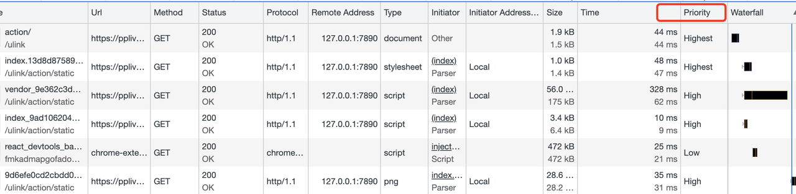
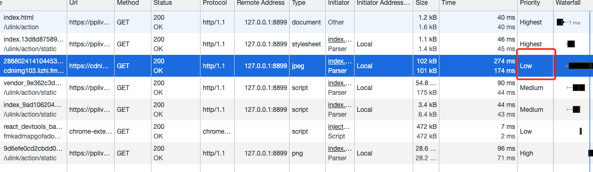
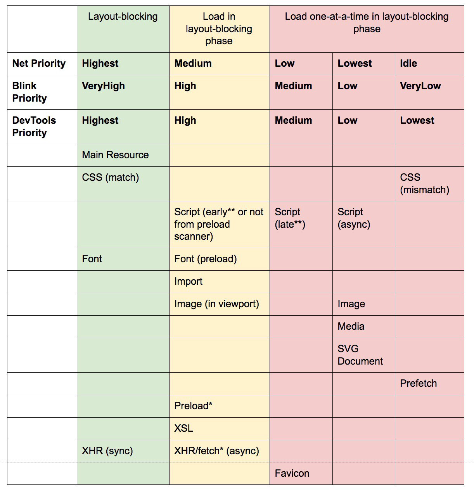
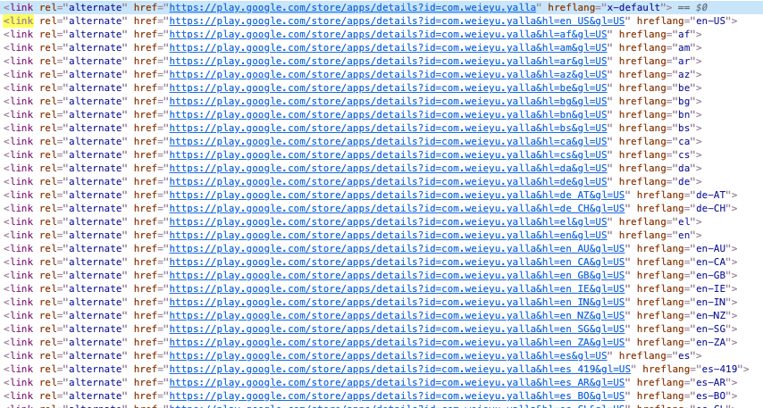

# `<link>` 使用场景

link，很普通的一个标签，在刚开始接触 html 的时候就知道了可以用来引入 css 文件，但其实它不仅仅只是用来引入 css 文件，还有很多很妙的应用场景。

## 基本用法

### 一、链接样式表

基于页面的维护、文档大小、解析优化等，通常我们会把 css 抽离成一个.css 文件，然后通过 link 引用，如下：

<link rel="stylesheet" href="xxxx.css" />
有时候我们会碰到站点需要提供“多主题选择功能”的需求，那么通常比较直接的就是用 class 去控制，通过切换class的方式来实现；例如:

```css
.hightLight {
  color: #000...;
}
.dark {
  color: #fff...;
}
```

### 二、指定 favicon

为站点提供一个 icon，如下：

```html
<link rel="icon" href="favicon32.png" />
如果想要更好的展示效果，可以根据不同的设备设置不同的icon，通过 rel 和
sizes属性的配置，如下：
<!-- third-generation iPad with high-resolution Retina display: -->
<link
  rel="apple-touch-icon-precomposed"
  sizes="144x144"
  href="favicon144.png"
/>
<!-- iPhone with high-resolution Retina display: -->
<link
  rel="apple-touch-icon-precomposed"
  sizes="114x114"
  href="favicon114.png"
/>
<!-- first- and second-generation iPad: -->
<link rel="apple-touch-icon-precomposed" sizes="72x72" href="favicon72.png" />
<!-- non-Retina iPhone, iPod Touch, and Android 2.1+ devices: -->
<link rel="apple-touch-icon-precomposed" href="favicon57.png" />
<!-- basic favicon -->
<link rel="icon" href="favicon32.png" />
```

以上这两个用法可能都有用过，但是下面的几种用法，对于页面的优化有很好的效果，却发现很多人原来都没用过。

## 其他用法

在我们的站点内发起一个接口请求的时候，不可避免过程：dns 解析->建立 tcp 链接（https 还会有 ssl 的握手），如果这一过程可以前置，那么是可以节省一定的时间的

### 一、 dns-prefetch

向浏览器提示，可以提前解析该域名，以便可以更快的获取链接内容。

```html
<link rel="dns-prefetch" content="//a.com" />
```

### 二、preconnect

向浏览器提供提示，建议浏览器提前打开与链接网站的连接，而不会泄露任何私人信息或下载任何内容，以便在跟随链接时可以更快地获取链接内容。

```html
<link rel="preconnect" content="//a.com" />
```

### 三、preload，as，importance 当前页面需要使用的资源。

浏览器有预加载扫描器，在打开 chrome
devTool 之后，看到 network 面板上 Priority，标识了浏览器对于资源下载的优先级。



在浏览器自己的预加载机制之外，开发者也可以人为指定一些资源预加载，通过 preload + as（显式申明资源类型）。

`<link ret="preload" content="//a.com/statis/test.js" as="script" />`

对于设置了 rel="preload" 的 link 标签，正确的使用 as 是必要的，浏览器会根据内容的类型来匹配优先级；
例如：



以上两个 img 的图片都会被下载，但由于 display:none 的标签在并不会渲染出来的原因，对应这张图片的 Priority 是 low，如下：

importance

指定资源下载的优先级，分别是，auto（无设置，根据浏览器设定）,hight（优先级较高）,low（优先级较低）

chrome 在预加载优先级策略如下：



### 四、prefetch

提示浏览器提前加载链接的资源，因为它*可能*会被用户请求。

```html
//腾讯视频pc web
<link rel="prefetch" href="https://v.qq.com/x/cover/mzc00200xh9313v.html" />
```

以上是从腾讯视频站点采集的，把当前热门的电视剧页面加了 prefetch，应该是根据站点的热门点击动态调整。

### 五、crossorigin

指定在加载相关资源时是否必须使用 CORS，_启用了 CORS 的图片可以在 Canvas 中使用_
（曾经有遇到过类似问题，那时候的处理方式是后端用同域下的接口获取文件返回文件流）

“anonymous”

会发起一个跨域请求(即包含 Origin: HTTP 头). 但不会发送任何认证信息 (即不发送 cookie, X.509 证书和 HTTP 基本认证信息). 如果服务器没有给出源站凭证 (不设置 Access-Control-Allow-Origin: HTTP 头), 资源就会被污染并限制使用.

"use-credentials"

会发起一个带有认证信息 (发送 cookie, X.509 证书和 HTTP 基本认证信息) 的跨域请求 (即包含 Origin: HTTP 头). 如果服务器没有给出源站凭证 (不设置 Access-Control-Allow-Origin: HTTP 头), 资源就会被污染并限制使用.

当不设置此属性时, 资源将会不使用 CORS 加载

```html
<!-- facebook -->
<link
  href="https://static.xx.fbcdn.net/rsrc.php/v3ipIp4/yX/l/zh_CN/suwOLbpGGk-.js?_nc_x=Ij3Wp8lg5Kz"
  rel="preload"
  as="script"
  crossorigin="anonymous"
/>
```

从 fb 的站点下面，可以看到大量的 link 标签的应用。

### 六、alternate + hreflang

alternate 谷歌翻译为”备用“；在实际的使用场景表现也确实是如此；

例如，下图是 googlePlay 页面的部分 dom；通过 alternate + href + hreflang 来实现多语言 seo 的优化；



官方例子则是通过 alternate + title 来实现网页多样式显示,如下：

```html
<!-- 用户可以在浏览器菜单 "查看>页面样式" 来选择网页的样式。通过这一办法，可以用多种样式浏览网页 -->
<link href="default.css" rel="stylesheet" title="Default Style" />
<link href="fancy.css" rel="alternate stylesheet" title="Fancy" />
<link href="basic.css" rel="alternate stylesheet" title="Basic" />
```

::: tip 参考文档
[Preload, Prefetch And Priorities in Chrome](https://medium.com/reloading/preload-prefetch-and-priorities-in-chrome-776165961bbf#id_token=eyJhbGciOiJSUzI1NiIsImtpZCI6IjQ2Mjk0OTE3NGYxZWVkZjRmOWY5NDM0ODc3YmU0ODNiMzI0MTQwZjUiLCJ0eXAiOiJKV1QifQ.eyJpc3MiOiJodHRwczovL2FjY291bnRzLmdvb2dsZS5jb20iLCJuYmYiOjE2MjkwODIzMTAsImF1ZCI6IjIxNjI5NjAzNTgzNC1rMWs2cWUwNjBzMnRwMmEyamFtNGxqZGNtczAwc3R0Zy5hcHBzLmdvb2dsZXVzZXJjb250ZW50LmNvbSIsInN1YiI6IjExNTM5MTY0MjY4ODY5ODU2MTMzNyIsImVtYWlsIjoiaGFueWl0aW1AZ21haWwuY29tIiwiZW1haWxfdmVyaWZpZWQiOnRydWUsImF6cCI6IjIxNjI5NjAzNTgzNC1rMWs2cWUwNjBzMnRwMmEyamFtNGxqZGNtczAwc3R0Zy5hcHBzLmdvb2dsZXVzZXJjb250ZW50LmNvbSIsIm5hbWUiOiJoYW55aSB0aW0iLCJwaWN0dXJlIjoiaHR0cHM6Ly9saDMuZ29vZ2xldXNlcmNvbnRlbnQuY29tL2EvQUFUWEFKelU5Q093S0N4LTROdmpnWXZmWGFocnBzalJtZzRkamlCXzF2NXI9czk2LWMiLCJnaXZlbl9uYW1lIjoiaGFueWkiLCJmYW1pbHlfbmFtZSI6InRpbSIsImlhdCI6MTYyOTA4MjYxMCwiZXhwIjoxNjI5MDg2MjEwLCJqdGkiOiI4MTk3MWRmZTAyN2EwNWZkMDcyYzlhOTdlZjNjMzkwYmFlMmU3NGRiIn0.DEz0uL6HnsU8L1Wo7UxVft0i_0X3-_tgVnbH_0pJ0KIttK8oZ7HZZzk94gWy7ZALSYTvttuuUUCLvf2CYaV39yGqeNLqTLbDDBe-YA6m8DlFpyADPpfmomEPAbRDPjyqidJsWainR7k7GlNCLsa9MzEB9HndTdPFeoXAxUnhXlIb9NjX5DKX9QRrk2eX-SdOTl-An13pNH9mpvSnLnEiRhbRPcFcn7Cegx14V3xOWyFk4jawNjkynp7D5J7IWUCFE2U7HZtthmiZ-jA_-9cmrFk0M4jkKNsAFSs-cTh3AaQyoE2IjbPwi2n-dkYFFedWxWSFamdOmkHyztVa5euOmw)

[link,外部资源链接元素](https://developer.mozilla.org/zh-CN/docs/Web/HTML/Element/link#attr-importance)

[链接类型](https://developer.mozilla.org/zh-CN/docs/Web/HTML/Link_types)
:::
