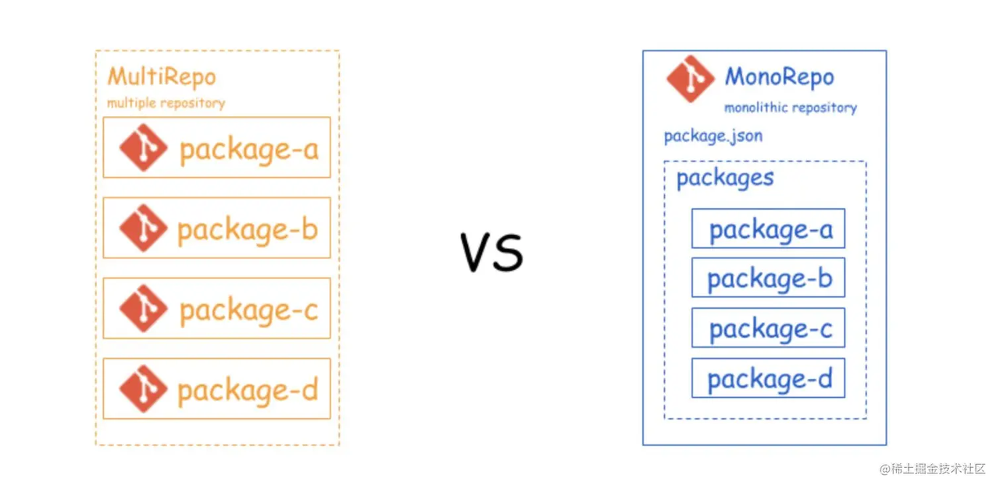
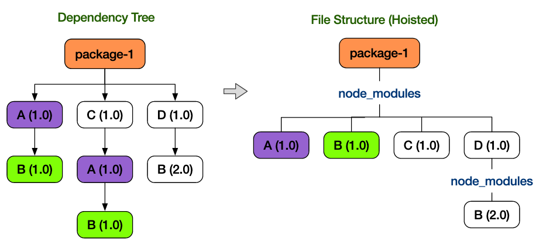
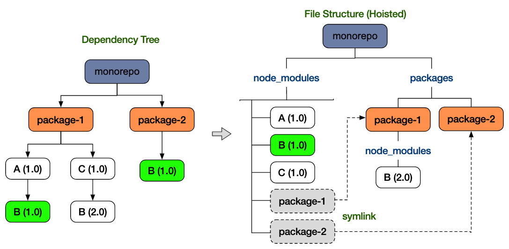
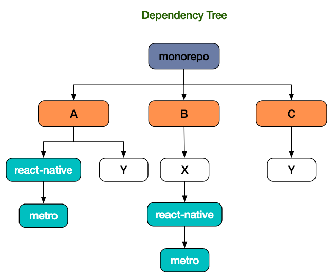
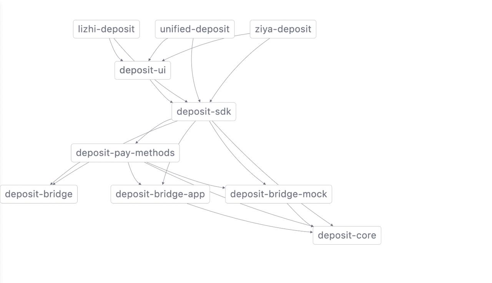

# Monorepo 初探

[[toc]]

> monorepo 本身并不是一个新的概念，只是旧事重提

## 什么是 monorepo?

单个代码库里包含了许多项目的代码，这些项目虽然有可能是相关，但通常在逻辑上是独立的，并由不同的“团队[每个人都可以是一个团队]”维护 的 一种代码管理策略。

### 优缺点

优点：

- 易于代码重用
- 简化依赖管理，
- 大规模代码重构
- 跨团队协作

缺点：

- 新人学习成本比较高
- 缺乏每个项目的访问控制
- 默认情况下需要更多的存储空间

### 与 monorepo 对应的是 multirepo

multirepo 则是通过多个仓库的方式来管理每一个模块、功能或者应用。无论是 monorepo 或者 multirepo，都只是一种软件开发中代码的管理策略，本身并无孰优孰劣的区别，也不是非 mono 即 multi 的问题。

如图：



## 创建一个 monorepo 项目

### 众说纷纭

脉脉某个程序抛出了个问题“现在前端搞 monorepo 比较好的方案有没有”

- yarn+workspaces
- lerna
- rush + pnpm
- pnpm workspace
- pnpm + @abmao/pkgs
- pnpm +turborepo+changesets（pnpm workspace 做拆分，changeset 做版本控制，turborepo 做多线程打包） , 水平够上 rush。
  - 这三套加起来就是 rush。
- rush or pnpm + workspace
- lerna + (yarn + workspace)

### 一、yarn workspaces

#### hoist & nohoist

hoist /hɔɪst/

hoist： 将公共的依赖包提取出来，集中到同一层目录下。如下图：



事实上，在有些时候，在打包子项目的时候，会出现模块找不到的情况，例如 package-1 打包的时候，依赖的 A（1.0）可以在 node_module,找到 B(1.0)，但是 C(1.0)并不一定是支持 monorepo 模式的第三方库。如下图：



nohoist
是一种处理对 monorepo 不兼容的第三方库的一个方案，可以通过配置 nohoist 指定 yarn 不对该模板进行提示。如：

```js
//根目录package.json
{
  "workspance":{
    "packages":["packages/*"]
    "nohoist": ["**/react-native", "**/react-native/**"]
  }
}
//子项目，不使用nohoist
{
  "workspaces": {
    "packages": ["packages/*"],
  }
}
//子项目，使用nohoist
{
  "workspaces": {
    "nohoist": ["react-native", "react-native/**"]
  }
}
```



#### 什么是 workspace

1. 当项目中的 package 有依赖关系时，workspace 会自动对 package 的引用设置软链接（symlink）,且链接仅限于当前的 workspace。
2. 所有的 package 的依赖都会安装在根目录的 node_modules，节省一定的空间。
3. 依赖同一份 yarn.lock。

#### 使用 workspace

配置 package.json

```js
//package.json
{
  "name": "monorepo-demo",
  "private": true,
  "workspaces":[
    "packages/*"
  ]
}

private:true
设置根目录的内容不发布。
workspaces
声明workspace中package的路径。
```

##### 项目运行

`yarn workspace [package-name] commond`

##### 例如

```
-monorepo
  -packages
    -hy-gift-display
    -pw-coolect
-package.json
```

mult: `npm run start`

mono: `yarn workspace hy-gift-display run start`

##### 查看 workspace 依赖树

`yarn workspaces info --json`

```js
npm包整合demo
{
  "app1": {
    "location": "packages/app1",
    "workspaceDependencies": [],
    "mismatchedWorkspaceDependencies": [
      "jsfunc"
    ]
  },
  "app2": {
    "location": "packages/app2",
    "workspaceDependencies": [
      "jsfunc"
    ],
    "mismatchedWorkspaceDependencies": []
  },
  "app3": {
    "location": "packages/app3",
    "workspaceDependencies": [],
    "mismatchedWorkspaceDependencies": []
  },
  "app4": {
    "location": "packages/app4",
    "workspaceDependencies": [],
    "mismatchedWorkspaceDependencies": []
  },
  "jsfunc": {
    "location": "packages/jsfunc",
    "workspaceDependencies": [],
    "mismatchedWorkspaceDependencies": []
  }
}
```

workspaceDependencies: 工作区内依赖的 package

mismatchedWorkspaceDependencies：工作区内依赖的 package，但版本不匹配。

##### 问题：

- 当一个子项目更新后，只能手动追踪依赖更新版本。

### 二、lerna 5.1+

什么是 lerna？在 yarn 1.x workspace 官方的文档里面有这样一段描述。

Yarn’s workspaces are the low-level primitives that tools like Lerna can (and do!) use.

yarn 对于 lerna 的描述是一个更好的一个解决方案/用法，也明确表示不会去支持类似 lerna 中的功能。那在 lerna 的官网的描述是这样的，“是一个管理工具，用于管理包含多个软件包（package）的 JavaScript 项目。”

#### 开始一个 lerna 项目

[https://github.com/lerna/getting-started-example](https://github.com/lerna/getting-started-example) 可以直接拉取这个案例在本地尝试。

`$ npx lerna init`

多了一个 lerna.json

```js
{
  "packages": [
    "packages/*"
  ],
  "useNx": false,
  "version": "0.0.0"
}
```

packages: 指定 workspace 的目录

useNx: 是否使用 Nx。

**packages 很好理解，那什么是 Nx？**

Smart,Fast and Extendsible Build System. Next generation build sysem with first class monorepo support and powerful integrations.

这是一个可以独立使用的 monorepo 的构建系统，具体可以看官网，在 learn 中，nx 扮演的角色是“缓存已构建内容”， 默认情况下，本地缓存有效期为一周，一周后将自动清除。

nx 除了扮演缓存的角色之后，还有一个我们可以用到的功能，就是可视化 monorepo 项目之间的依赖管理，如：

`$ npx nx grap`

某仓库内 pacekge 的关系如下：



#### 常用命令

`$ lerna boostrap`

当在一个 lerna-monorepo 项目运行 boostrap，会进行以下行为：

1. 在各个 packages 内执行 npm install
2. 将 packages 相互引用的子应用引用关联，让子应用之间可以像 npm 包那样调用，类似 npm link

注意：项目初始化需要执行。

`$ lerna run scriptName`

运行 script，例如

```
//demo1
$lerna run build
*等同于在所有子应用都运行 npm run build;
```

::: details 配置项
`--scope`

指定某个自引用运行 script。

`--stream`

leran 输出子应用打包子进程相关日志。

`--concurrency`

指定数量并发执行 script。
:::

`$ lerna clean`

清除子应用 node_module、monorepo 根目录 node_module

`$ lerna add <package>[@version] [--dev] [--exact] [--peer]`

::: details 配置项
`--dev`

packages 添加到 devDependencies

`--exact`

需要精确版本，例如 1.1.0 而不是^1.1.0

`--peer`
packages 添加到 peerDependencies
:::

`$ lerna import`

用于旧项目迁移，迁移 mulit 应用到 monorepo 项目底下，迁移的同时，会同时同步 master 的所有 commit，例如

::: tip 参考

1. [All in one：项目级 monorepo 策略最佳实践](https://fed.taobao.org/blog/taofed/do71ct/uihagy/)
2. [Monorepos in JavaScript & TypeScript](https://www.robinwieruch.de/javascript-monorepos/)
3. [monorepo 设计思路](https://www.yuque.com/docs/share/69ee97ff-42cc-46cf-a409-31967339a9cf)
4. [深入浅出 npm & yarn & pnpm 包管理机制](https://mp.weixin.qq.com/s/X6eehnbs055Gmiw56Zs_DA)
5. [nohoist in Workspaces](https://classic.yarnpkg.com/blog/2018/02/15/nohoist/)

:::
